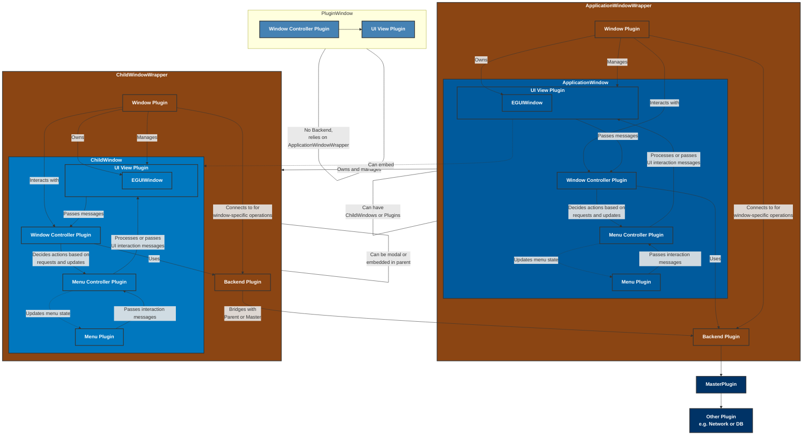

# Tauri Eframe Native App Toolkit

A toolkit for creating native applications using Tauri and Eframe, with a focus on producing cross-platform desktop applications with a great native experience. This toolkit uses a Plugin Architecture with a Message Bus system for improved modularity, extensibility, and inter-plugin communication.

**NB: This is still EXPERIMENTAL and UNDER DEVELOPMENT!!**

- Cross-platform desktop application development
- Plugin Architecture for modular design
- Message Bus system using crossbeam_channel for efficient inter-plugin communication
- Dynamic window management
- Customizable UI with draggable and resizable windows

## Dependencies

| Component | Description | Version |
|-----------|-------------|---------|
| tauri | runtime core | [](https://crates.io/crates/tauri) |
| egui | immediate mode GUI library for Rust | [](https://crates.io/crates/egui) |


## Motivation

The goal of this toolkit is to enable developers to produce cross-platform desktop applications that offer a seamless and native user experience. By leveraging the power of Tauri and Eframe, developers can build applications that are both lightweight and performant. The new Plugin Architecture allows for more flexible and maintainable code.

## Architecture
## C1 Diagram

```mermaid
graph TD
    style MainApp fill:#003366,stroke:#333,stroke-width:2px;
    classDef default fill:#003366,stroke:#333,stroke-width:2px,color:#ffffff,font-weight:bold;

    WindowControl[Window Control Plugin]
    UIView[UI View Plugin]
    Window[Window]
    MenuPlugin[Menu Plugin]
    MainApp[Main Application Window]
    
    WindowControl -->|Provides window control <br> functionality| MainApp
    UIView -->|Renders user <br> interface| MainApp
    Window -->|Manages window <br> display| MainApp
    MenuPlugin -->|Handles menu \n operations| MainApp

    MasterPlugin[MasterPlugin] -->|Manages overall <br> application| MainApp
    
    MainApp -->|Contains and \n manages| ChildPlugins[Child Plugins]
    ChildPlugins -->|Handles background <br> tasks| BackgroundPlugin[Background Plugin]
    ChildPlugins -->|Manages additional <br> window features| WindowPlugin[Window Plugin]
    ChildPlugins -->|Wraps window <br> functionality| WindowWrapper[Window Wrapper]

    %% Apply the default class to all nodes for styling
    class WindowControl,UIView,Window,MenuPlugin,MainApp,MasterPlugin,ChildPlugins,BackgroundPlugin,WindowPlugin,WindowWrapper default
```




## Plugin Architecture 
(Not up to date)

The toolkit now uses a Plugin Architecture, which includes:

- `UiControllerPlugin`: Manages the overall UI and coordinates between plugins.
- `WindowPlugin`: Handles window rendering and maintains the collection of created windows. It's responsible for the visual representation and direct interaction with windows in the UI.
- `WindowControllerPlugin`: Manages high-level window tasks, stores window metadata and properties, and handles communication with other plugins. It orchestrates window-related operations without directly rendering them.
- `MessageBus`: Facilitates communication between plugins using crossbeam_channel.

## crossbeam_channel and Its Benefits

This project utilizes `crossbeam_channel` for its Message Bus system, which offers several advantages:

1. **High Performance**: `crossbeam_channel` is designed to be highly efficient, especially in multi-threaded scenarios, making it ideal for responsive GUI applications.

2. **Zero Allocation**: The channels provided by `crossbeam_channel` don't allocate memory on the heap for each send operation, reducing memory overhead.

3. **Multiple Producers and Consumers**: It supports multiple sender and receiver endpoints, which is perfect for our plugin architecture where various components need to communicate.

4. **Flexible Channel Types**: Offers both bounded and unbounded channels, allowing for fine-tuned control over message buffering.

5. **Select Operation**: Provides a `select` operation for waiting on multiple channels simultaneously, which can be useful for complex event handling scenarios.

6. **Drop Semantics**: Channels are automatically closed when all senders or all receivers are dropped, preventing resource leaks.

By leveraging `crossbeam_channel`, our Message Bus system gains robustness, efficiency, and flexibility, enabling smooth communication between plugins without compromising performance.


## Example: How to Create an Application with Draggable Windows

Here's a simplified example of how to create a basic application with draggable windows using Tauri, Eframe, and our Plugin Architecture:

```rust
//main.rs
use eframe::{egui, CreationContext, NativeOptions, App};
use plugins::window_management::{WindowPlugin, WindowState, WindowControllerPlugin};
use std::sync::{Arc, Mutex};
use crossbeam_channel::{unbounded, Sender};

mod plugins;
use crate::plugins::ui_controller::UiControllerPlugin;

struct TauriEframeNativeApp {
    ui_controller: UiControllerPlugin,
}

impl TauriEframeNativeApp {
    pub fn new(cc: &eframe::CreationContext<'_>) -> Self {
        let (tx, rx) = crossbeam_channel::unbounded();
        let state = Arc::new(Mutex::new(WindowState::new(tx.clone())));
        
        let (tx, rx) = crossbeam_channel::unbounded();
        let mut ui_controller = UiControllerPlugin::new(cc, tx.clone(), state.clone());
        
        let window_plugin = WindowPlugin::new(tx.clone(),rx.clone());
        ui_controller.add_plugin(Box::new(window_plugin));
        
        let window_management_plugin = WindowControllerPlugin::new(tx.clone(),rx.clone());
        ui_controller.add_plugin(Box::new(window_management_plugin));
        
        // Add other plugins as needed
        // let new_plugin = NewPlugin::new(tx.clone(),rx.clone());
        // ui_controller.add_plugin(Box::new(new_plugin));

        Self {
            ui_controller,
            // initialize other fields if needed...
        }
    }
}

impl App for TauriEframeNativeApp {
    fn update(&mut self, ctx: &egui::Context, frame: &mut eframe::Frame) {
        self.ui_controller.update(ctx, frame);
    }
}

fn main() -> Result<(), eframe::Error> {
    let options = NativeOptions::default();

    eframe::run_native(
        "window_management Demo",
        options,
        Box::new(|cc| Ok(Box::new(TauriEframeNativeApp::new(cc))))
    )
}
```

## Getting Started

There are two main ways to use the Tauri Eframe Native App Toolkit:

### Option 1: Using the Existing Toolkit

1. **Clone the repository**

```bash
git clone https://github.com/your-username/tauri-eframe-native-app-toolkit.git
git switch dynamic_strict_plugin_architecture
cd tauri-eframe-native-app-toolkit
```

```rust
cargo install tauri-cli
```

```rust
cargo tauri dev
```

This will compile and run the example application in development mode.

### Option 2: Creating Your Own Application Using the Toolkit
Create a new Rust project and navigate to its directory:

```rust
cargo new my-tauri-app
cd my-tauri-app
```

Set up Tauri in your project:
```rust
cargo tauri init
```

Add the necessary dependencies to your Cargo.toml:
```sh
[dependencies]
tauri = { version = "2.0.0-rc", features = [] }
egui = "0.15"  # or the latest version
eframe = "0.28.1"  # or the latest version
crossbeam-channel = "0.5.8"
tauri-eframe-native-app-toolkit = { git = "https://github.com/your-username/tauri-eframe-native-app-toolkit.git" }
```

Replace the contents of src-tauri/src/main.rs with the following code:
```rust
use eframe::{egui, NativeOptions};
use tauri_eframe_native_app_toolkit::{UiControllerPlugin, WindowPlugin, WindowControllerPlugin, MessageBus};

struct MyTauriApp {
    ui_controller: UiControllerPlugin,
}

impl MyTauriApp {
    fn new(cc: &eframe::CreationContext<'_>) -> Self {
        let mut ui_controller = UiControllerPlugin::new();
        ui_controller.add_plugin(Box::new(WindowPlugin::new()));
        ui_controller.add_plugin(Box::new(WindowControllerPlugin::new()));
        Self { ui_controller }
    }
}

impl eframe::App for MyTauriApp {
    fn update(&mut self, ctx: &egui::Context, _frame: &mut eframe::Frame) {
        self.ui_controller.update(ctx);
    }
}

fn main() -> Result<(), eframe::Error> {
    let options = NativeOptions::default();
    eframe::run_native(
        "My Tauri App",
        options,
        Box::new(|cc| Box::new(MyTauriApp::new(cc))),
    )
}
``

Run your application:
```rust
cargo tauri dev
```

Build for production (don't do it - yet!) when you're ready:
```rust
cargo tauri build
```

For more detailed information on customizing your application, adding features, and working with the plugin system, refer to the documentation and examples provided in this repository [todo].

## Contributing

Contributions are welcome! Please feel free to submit a Pull Request.

## License

This project is licensed under the MIT License.
